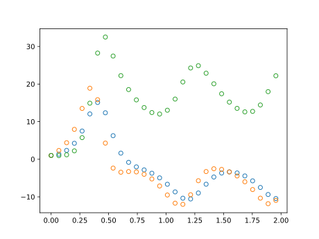
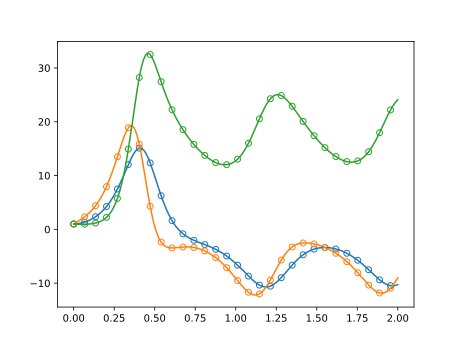

# ODE system parameter estimator

This is a little python package to provide convenience functions that use the `scipy` capabilities for ODE systems and curve fitting in order to estimate the correct parameters of the ODE system for a given set of data.

## Usage

In the fashion of `scipy.integrate.solve_ivp`, we have an ODE system
$$
\frac{dy}{dt} = f(t,y,p)
$$
where $t$ is the independent parameter, $y$ a vector function and $p$ a parameter list. If we numerically solve the system with `solve_ivp` we would get a time array `solution.t` and a matrix `solution.y` whose rows are the trayectories of the components of $y$.

The `EstimatorProblem` class requires the data to be in this form: a time array, a samples array in row order, and the derivative function. For example, here is the [Lorenz chaotic oscillator](https://en.wikipedia.org/wiki/Lorenz_system):

$$
\frac{\mathrm{d}x}{\mathrm{d}t} = \sigma (y - x), \qquad
\frac{\mathrm{d}y}{\mathrm{d}t} = x (\rho - z) - y, \qquad
\frac{\mathrm{d}z}{\mathrm{d}t} = x y - \beta z.
$$

```python
def lorenz(t,Y,*args):
    σ,ρ,β = args
    x,y,z = Y
    return np.array([
        σ*(y-x),   # dx/dt
        x*(ρ-z)-y, # dy/dt
        x*y-β*z    # dz/dt
    ])
```

along with some data in a file, by columns `t, x, y, z`
```python
#   t       x       y        z
0.00000 1.00100 1.00100  1.00100
0.06742 1.34734 2.32878  0.95351
0.13483 2.34594 4.39342  1.17407
0.20225 4.24041 7.94361  2.22541
0.26966 7.50201 13.50709 5.74678
...
```

which can be imported and visualized like

```python
t,*Y = np.loadtxt("samples.dat",unpack=True)
Y = np.array(Y)
plt.plot(t,Y.T,"o",fillstyle='none')
```


The parameter fitting is done by simply
```python
problem = EstimationProblem(t,Y,lorenz)
problem.fit([9,28,2]) # initial guess
```

which will hopefully display a message saying that the fit was successful. That success is heavily dependant of the quality of the initial guess, specially in chaotic or ill-behaved systems.

We can test the solution with the help of the `EstimationProblem.output` method, which evals the solution on the requested times:

```python
ts = np.linspace(0,2,200)
Ys = problem.output(ts)

plt.plot(t,Y.T,"o",fillstyle='none')
plt.gca().set_prop_cycle(None) # reset color cycle
plt.plot(ts,Ys.T)
```


### More examples

On [test/systems.py] are implementations of:

* Radioactive decay
* Housekeeping gene expression
* Lotka-Volterra
* SIR epidemics
* Damped coupled oscillators
* Lorenz-Fetter-Hamilton oscillator

All of them are tested with [clean solutions](test/exact.ipynb) and with [noisy solutions](test/inexact.ipynb) to emulate experimental data.


## Similar tools

There is, in Julia, [a whole ecosystem of packages](https://diffeq.sciml.ai/stable/analysis/parameter_estimation/) that implements several methods to do "dynamic data analysis". Not only there is a package named [DiffEqParamEstim.jl](https://diffeqparamestim.sciml.ai/dev/), but there are also packages that find parts of the ODE system using scientific machine-learning.

## TO DO

- [ ] Implement dimension checking to avoid obscure error traces.

- [ ] Finish documentation. Again.

- [ ] Give the option to also fit the initial conditions. This **should** be possible, as the first data point should be a good initial guess.

- [ ] Understand better the fail conditions, and provide more information.

